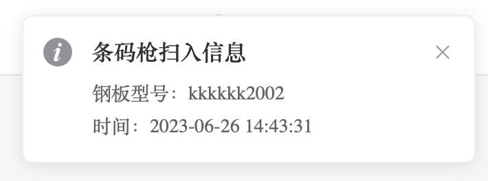
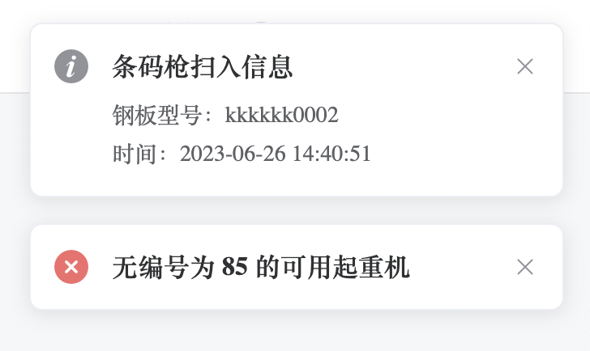
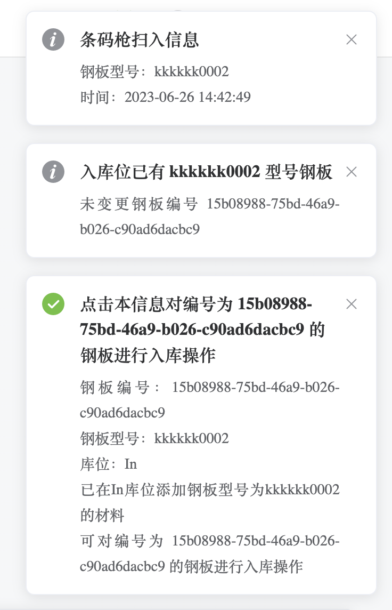
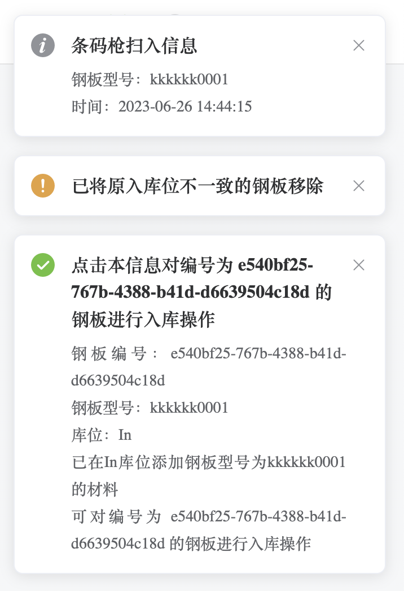
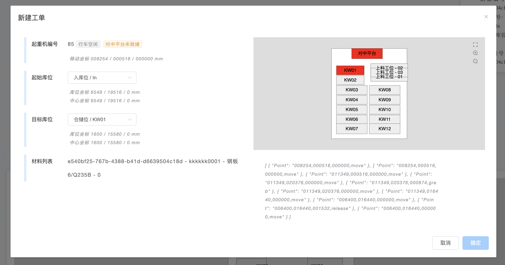
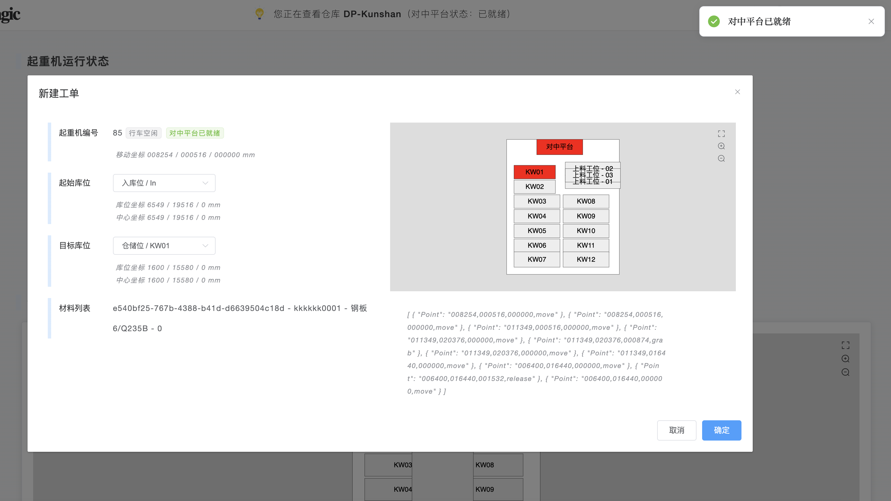
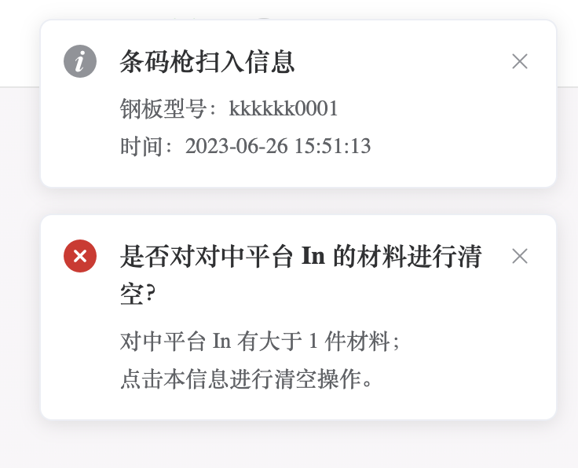
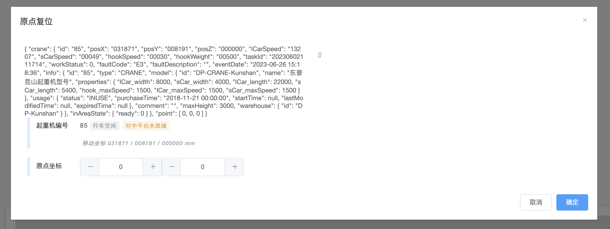

# 如何使用

## 2023-06-23 更新专用

### 对中平台状态

WMS 持续从 UDP 5025 端口接收对中平台是否就绪的信号，当对中平台就绪时，页面实时更新。

### 条码枪扫入

条码枪扫入钢板型号的二维码，通过 TCP 协议发送至 [本机IP] 的5024端口。

若无条码枪，可直接使用 TCP 协议传输材料型号。

- **钢板型号不存在**（目前的方式是查库位表中的`comment`）：

    仅提示条码枪扫入，没有后续信息。

    {: style="width:360px"}

- **没有正在运行的起重机**：

    {: style="width:360px"}

- **对中平台 In 有且仅有 1 件材料，钢板型号一致**：

    {: style="width:360px"}

- **对中平台 In 有且仅有 1 件材料，钢板型号不一致**：

    {: style="width:360px"}

点击信息入库，弹出新建工单窗口，已根据入库型号填入相应信息。

{: style=""}

可见当前对中平台未就绪的情况下，“确定”按钮为不得点击的状态。

WMS 持续接收对中平台是否就绪的信号，当对中平台就绪时，页面实时更新。点击“确定”即发送工单。

{: style=""}

- **对中平台 In 有大于 1 件材料**：

    {: style="width:360px"}

### 原点复位

每一个起重机均有原点复位的按钮，点击弹出窗口。

{: style=""}
